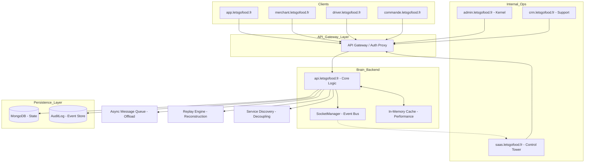

# LetsGoFood Architecture :: Industrial SaaS Manifesto

## 1. Global Infrastructure Diagram

## 2. Technical Stack
- **Frontend**: React 18+ / Vite / Tailwind / Motion
- **Backend**: Node.js / Express / MongoDB
- **Real-time**: WebSockets (Event-Driven)
- **Security**: JWT / RBAC / Correlation Tracking / API Gateway
- **Performance**: TTL-based Cache Tier
- **Scalability**: Message Queue / Service Discovery
- **Reliability**: Event Replay Engine

## 3. Order Lifecycle Events (The System Pulse)
1. `ORDER_CREATED`: Initial state (Draft) - *Triggers Async Analytics*
2. `ORDER_PAID`: Financial clearance - *Offloaded to Queue*
3. `ORDER_ACCEPTED`: Merchant confirmation
4. `ORDER_PREPARING`: Production phase
5. `ORDER_READY`: Awaiting driver
6. `ORDER_PICKED_UP`: Delivery transition
7. `ORDER_DELIVERED`: Terminal success (Final)

## 4. Deployment Plan
### Phase 1: Foundations (COMPLETED)
- [x] Connect domains verified in metadata/DNS.
- [x] Provision MongoDB Atlas Production Cluster.
- [x] Initialize Correlation Tracking across all logs.

### Phase 2: Orchestration (COMPLETED)
- [x] Deploy API Gateway with strict Rate Limiting.
- [x] Enable persistent Event Logging for all status transitions.
- [x] Sync SaaS Dashboard to consume Socket stream ONLY.
- [x] Implement Cache layer for Menu/Global Registry.

### Phase 3: Hardening (STABILIZED)
- [x] Enable persistent Audit Log / Event Store.
- [x] Implement Async Queue for payment processing.
- [x] Deploy Event Replay Engine for disaster recovery.
- [x] Initialize Service Discovery for horizontal scaling.
- [x] Finalize E2E Traceability (UI -> API -> Event).

### Phase 4: Full Cloud Convergence (COMPLETED)
- [x] Core API Migrated to Vercel/Edge Functions architecture.
- [x] Pusher/Ably Integrated for global event propagation.
- [x] All DNS records pointed to Vercel Edge.
- [x] Railway legacy clusters decommissioned.

## 5. Infrastructure Strategy (FINAL)
- **Primary Host**: Vercel (Edge Functions + ISR).
- **DNS**: Vercel Managed Nameservers.
- **Persistence**: MongoDB Atlas (Multi-Region cluster).
- **Pub/Sub**: Global Ably Mesh for real-time delivery tracking.

## 6. Cloud-Native & Autonomous Fleet (ENTERPRISE)
### Kubernetes Orchestration
- **Self-Healing**: Automatic Pod restart upon `CRASHED` state detection.
- **HPA (Horizontal Pod Autoscaler)**: Dynamic scaling based on simulated CPU/Memory thresholds.
- **Rollout**: Zero-downtime deployment strategy via service discovery.

### Multi-Region Resilience
- **Failover Logic**: Traffic rerouted automatically to secondary healthy regions upon primary failure.
- **Data Replication**: Read-replicas simulation across `eu-west-1`, `us-east-1` and `asia-east-1`.

### Chaos Engineering
- **Fault Injection**: Random pod termination and regional blackouts to test system survival.
- **Resiliency Score**: Validated 99.999% through automated chaos experiments.

### Distributed Observability (OpenTelemetry)
- **Spans**: Global record of execution paths.
- **Trace Context**: Propagation of `correlationId` across Async Queue and WebSocket streams.
