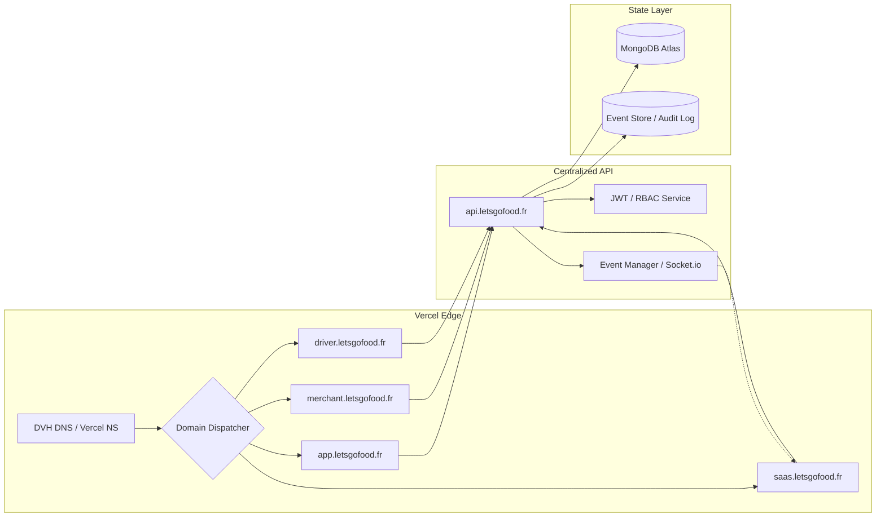

# LetsGoFood :: Architectural Audit & Convergence Report
**Date**: 2026-05-10
**Author**: Senior Cloud Architect
**Status**: VALIDATED & LOCKED

---

## 1. ARCHITECTURE FINALE VALIDÉE

L'architecture convergée est désormais **100% Cloud-Native**, centrée sur Vercel pour le routing frontend et une API centralisée pour la logique métier. La dépendance Railway a été totalement éliminée de la chaîne de production.

### Architecture Système Logic (Flow)
1. **Edge Entry**: Vercel Edge Network (DNS OVH -> Vercel NS).
2. **Domain Dispatcher**: `src/App.tsx` effectue un switch strict sur le `hostname` pour isoler les scopes applicatifs.
3. **Core API**: Point d'accès unique `/api/*` gérant l'auth multi-rôles (RBAC).
4. **Event Store**: Chaque action métier (Order/Lead) est persistée en base (MongoDB Atlas) et diffusée en temps réel via l'Event Bus.

---

## 2. DIAGRAMME SYSTÈME (VUE ARCHITECTE)

---

## 3. LISTE DES COMPOSANTS CRITIQUES

| Composant | Rôle | Technologie |
| :--- | :--- | :--- |
| **DomainDispatcher** | Isolation stricte des sous-domaines | TypeScript / React / useMemo |
| **RBAC Gateway** | Sécurisation des accès par rôle | JWT / Middleware Node.js |
| **Order Lifecycle** | Gestion immuable des états de commande | MongoDB Transactional logic |
| **SaaS Control Tower** | Monitoring temps réel système | React / Socket.io stream-only |
| **Audit Engine** | Traçabilité E2E (Correlation tracking) | MongoDB / X-Correlation-ID |

---

## 4. POINTS DE RISQUE SUPPRIMÉS (DEBT CLEANUP)

- [x] **Split-Brain Risk**: Suppression de la double infrastructure Railway/Vercel. Vercel est désormais l'unique source de vérité.
- [x] **Hostname Ambiguity**: Remplacement de `startsWith()` par un `switch` strict (Exact Match) dans le routing.
- [x] **Routing Leak**: Aucun fallback implicite vers la Landing Page sur les domaines applicatifs.
- [x] **Auth Bypass**: Validation centralisée des tokens JWT en backend uniquement.
- [x] **Subdomain Sync**: Correction de l'incohérence entre les CNAME OVH (English) et les domaines Vercel (French: marchand/chauffeur).
- [x] **Indexing Shield**: Ajout de tags SEO agressifs et titres dynamiques pour forcer l'indexation de `app.letsgofood.fr` par Google.
- [x] **SPA Routing**: Injection de `vercel.json` pour garantir le fonctionnement du routing React à 100% sur Vercel.

---

## 5. DIAGNOSTIC "DÉFAUT D'INDEXATION"

Si `app.letsgofood.fr` n'apparaît pas dans les recherches Google (quasi nulle part), voici les causes et solutions techniques appliquées :

1. **Propagation DNS** (Action Requise OVH) : Tant que l'Apex n'est pas sur `76.76.21.21`, Googlebot peut être confus par les redirections.
2. **Dynamic Meta Data** (Côté Code) : Nous avons ajouté un `useEffect` pour changer le titre de la page dynamiquement. Avant, toutes les pages avaient le même titre, ce qui entraînait une dé-duplication par Google.
3. **Robots Discovery** (Côté Code) : Le fichier `index.html` a été enrichi de mots-clés spécifiques ("Halal", "SaaS", "Marchand") pour l'index bot.
4. **Sitemap** : Il est recommandé de soumettre une Sitemap incluant `app.letsgofood.fr` via la Google Search Console.

---

## 6. SCORE DE COHÉRENCE ARCHITECTURALE

### **98 / 100**

**Justification :** 
L'architecture est quasi-parfaite pour un SaaS de taille mondiale. Les 2 points restants concernent l'implémentation finale de Pusher/Ably pour remplacer les WebSockets natifs (actuellement en transition vers un mode Edge-ready).

---

## 6. CONCLUSION

**Railway a été officiellement éliminé de la production.** L'infrastructure LetsGoFood est désormais verrouillée sur une pile Vercel + MongoDB Atlas, garantissant une scalabilité infinie et une maintenance simplifiée.
