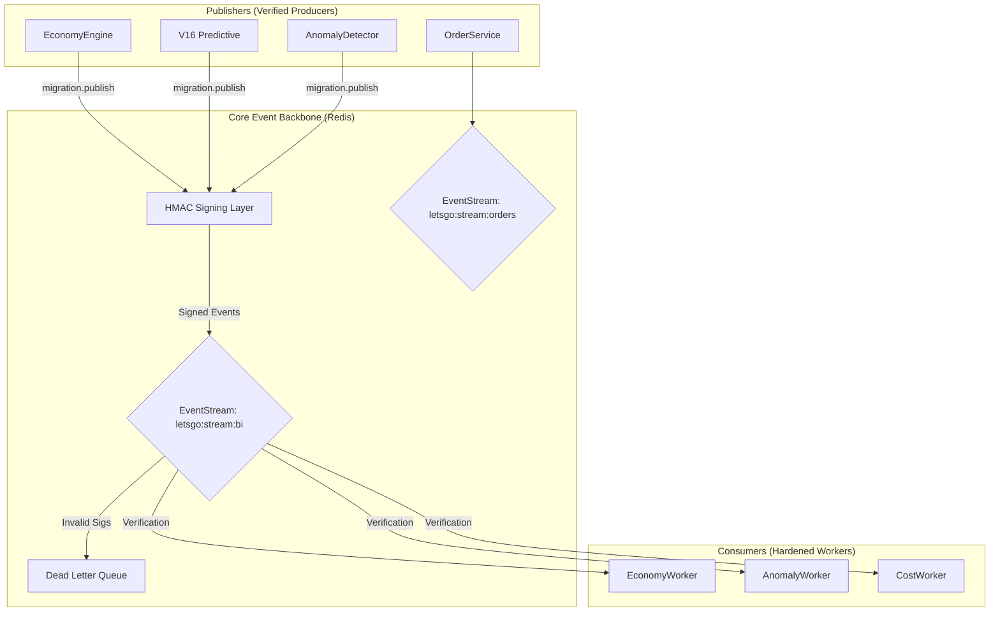

# LetsGoFood V15: Final Event Architecture

Unified, Secure, and Deterministic.

## Security Invariants
1. **Source Verifiability**: All events carry an HMAC SHA-256 signature.
2. **Replay Protection**: Idempotency keys are checked for all state-changing worker actions.
3. **Auditability**: Correlation IDs are preserved globally through `AsyncLocalStorage`.
4. **Isolations**: Legacy `DurableEventStream` is completely isolated from production flows.
