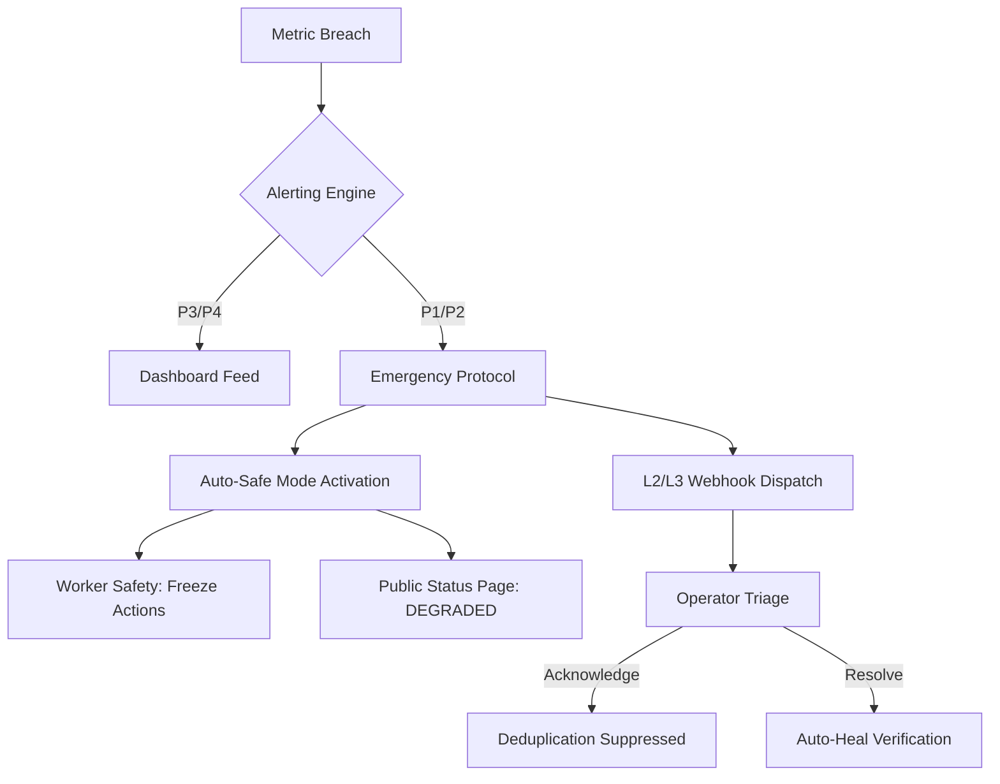

# LetsGoFood V15: Incident Escalation Flow

This protocol defines the automated and manual paths from initial alert detection to incident resolution.

## 1. Automated Escalation Path

## 2. Escalation Rules

| Trigger | Action | Target Channel |
|---------|--------|----------------|
| **P1 (Emergency)** | **Instant** | Webhook + Dashboard Banner + Safe Mode |
| **P2 (Critical)** | **2 Min Delay**| Dashboard Alert + Slack Hub |
| **P3 (Warning)** | **5 Min Delay**| Dashboard Feed Only |
| **P4 (Info)** | **N/A** | Logs / Audit Only |

## 3. Safe Mode Activation Logic
Safe Mode is triggered automatically if:
1. **Health Score < 50** for more than 30 seconds.
2. **P1 Security Breach** detected (e.g., HMAC verification failure spike).
3. **Database Reachability** lost for > 5 seconds.

## 4. Rollback Conditions
The on-call SRE should initiate a rollback (2-min target) if:
- A recent deployment correlates with a P1/P2 alert.
- `SelfHealer` attempts have failed for 3 consecutive cycles.
- Customer support ticket volume for "Checkout unreachable" exceeds 50 in 5 min.

## 5. Human-in-the-Loop Verification
- **Acknowledge**: Stops escalation timers but keeps alert visibly "Firing".
- **Force Recover**: Overrides `HealthMonitor` and exits Safe Mode. Requires a "Reason" log.
- **Snooze**: Silences recurring P3/P4 alerts for 1 hour.
