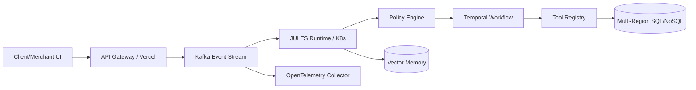

# INDUSTRIAL TARGET ARCHITECTURE :: LETSGOFOOD 2026

## 1. VISION INDUSTRIELLE
Passer d'une infrastructure "Cloud Native Basic" (Firebase/Vercel) à une architecture "Global Scale" capable de gérer des millions de transactions avec une latence sub-seconde et une orchestration IA autonome.

## 2. COMPOSANTES TECHNIQUES CIBLES

### Event Bus (Industrial Grade)
- **Migration**: Remplacer Firestore Event Storage par **Apache Kafka** ou **Redis Streams**.
- **Avantages**: Débit massif, rétention configurable, parallélisation réelle des consommateurs.

### Workflow Engine (Durable State Machines)
- **Choix**: **Temporal.io** ou **AWS Step Functions**.
- **Rôle**: Gérer les états JULES sur le long terme (ex: suivi d'une livraison sur 1h avec retries automatiques et persistence d'état).

### JULES Runtime Sandbox
- **Isolation**: Exécution des agents dans des micro-VMs ou isolats WebAssembly (Wasm).
- **Sécurité**: Empêcher un agent malveillant ou buggé d'accéder aux secrets Stripe ou aux données cross-tenant.

### Unified Memory Layer
- **Vector DB**: **Pinecone** ou **Weaviate** pour la mémoire sémantique.
- **Cache**: **Redis** pour la mémoire de session et opérationnelle chaude.

## 3. SCHÉMA DE FLUX FINAL

