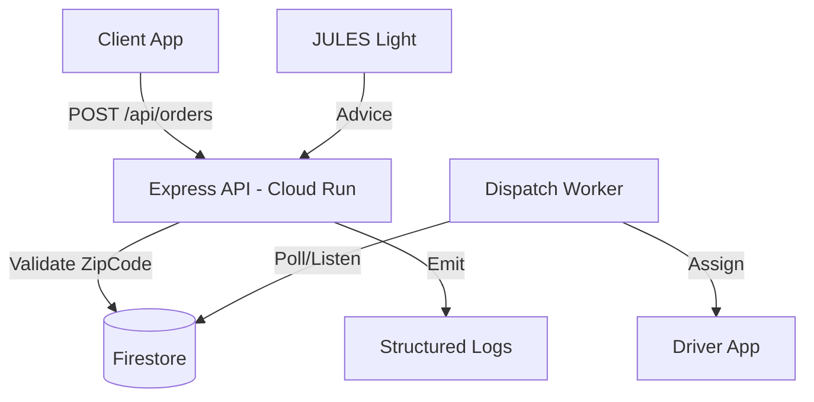

# PARIS V1 ARCHITECTURE SCHEMA

## 1. Request Flow (End-to-End)

## 2. Infrastructure Stack (Pragmatic)
- **Frontend**: Vercel (Edge Network).
- **Backend**: GCP Cloud Run (Region: europe-west1).
- **Storage**: Firestore (Regional).
- **Security**: JWT + Firestore RBAC rules.
