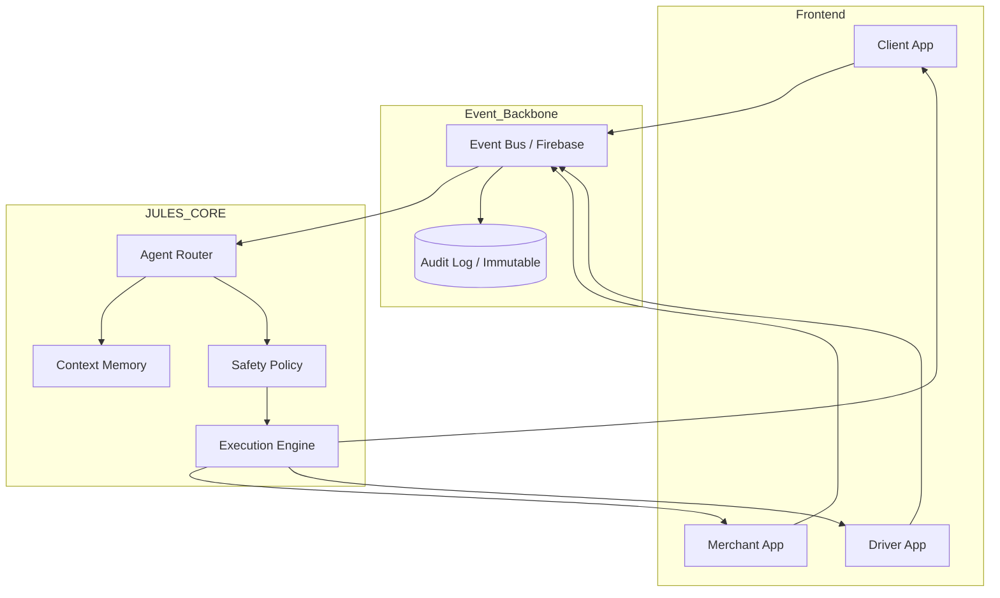

# LETSGOFOOD :: Strategic Architecture Target

## 1. VISION
Transformer LetsGoFood d'un SaaS classique vers un écosystème auto-orchestré par IA (JULES System).

## 2. COMPOSANTES CLÉS
### JULES Agent Router
- Réceptionne tous les événements métier via l'Event Bus.
- Distribue les tâches aux sous-agents (Logistique, CRM, Fraude).

### Workflow Engine (Event-Driven)
- Orchestration des états complexes.
- Exemple : Si commande non acceptée après 5 min -> JULES appelle le restaurant.

### Data Layer Unifié
- Firestore pour le temps réel.
- Audit Log immuable pour l'entraînement et la traçabilité.

## 3. SCHÉMA GLOBAL

