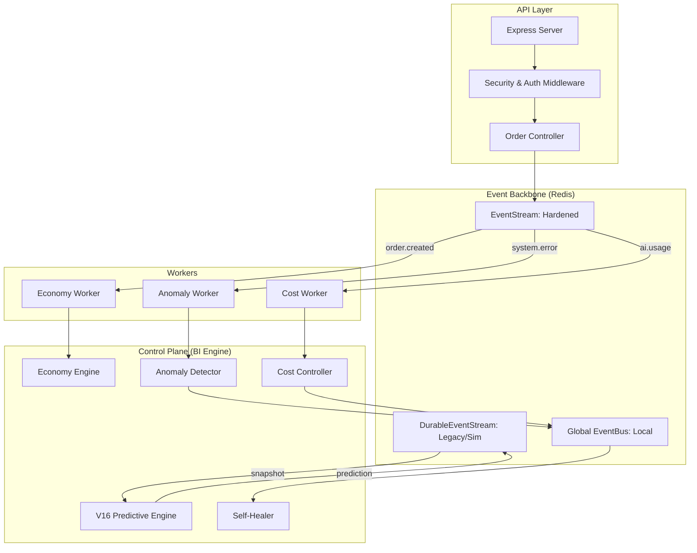

# LetsGoFood V15 Autonomous System Map

This document maps the architectural components and event flows of the LetsGoFood V15 Stable Platform.

## 1. System Architecture overview

## 2. Component Definitions

### API Layer
- **Express Server**: Entry point with standard hardening (Helmet, Rate Limiting).
- **Security Middleware**: JWT-based Authentication & RBAC (Role-Based Access Control).
- **Audit Logging**: Redacted PII logs for security events and user actions.

### Event Infrastructure
- **EventStream**: Production-grade stream management with HMAC signatures, retry logic (max 3), and Dead Letter Queue (DLQ).
- **DurableEventStream**: Simplified stream implementation primarily used by V16 and Economy simulation engines.
- **Global EventBus**: In-memory event emitter for low-latency local communication (e.g., Anomaly -> Healer).

### Autonomous Engines
- **V16 Predictive Engine**: Computes demand/supply predictions every 60s. Publishes pre-emptive scaling actions.
- **Economy Engine**: Simulates market drift and calculates dynamic surge multipliers.
- **Anomaly Detector**: Tracks system health and error spikes to trigger self-healing.
- **Self-Healer**: Orchestrates recovery actions (Restarting instances, flushing caches) based on anomaly severity.
- **Cost Controller**: Tracks multi-model AI spending and enforces budget thresholds.

## 3. Event Matrix

| Event Type | Source | Consumer | Domain | Channel |
|------------|--------|----------|--------|---------|
| `order.created` | OrderService | EconomyWorker | ECONOMY | EventStream |
| `system.error` | Monitoring | AnomalyWorker | ANOMALY | EventStream |
| `ai.usage.tracked`| AI Subsystems | CostWorker | COST | EventStream |
| `economy.snapshot`| EconomyEngine | DecisionEngine | - | DurableStream |
| `anomaly.detected`| Detector | SelfHealer | - | EventBus / Stream |
| `ai.throttled` | CostController | DecisionEngine | - | EventBus |
| `price.adjusted` | V16 / Economy | UI / Socket | - | DurableStream |
